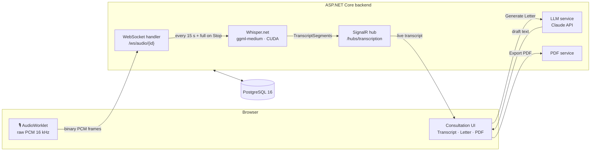

# Medical Clinic Consultation Assistant

[](https://dotnet.microsoft.com/)
[](https://learn.microsoft.com/dotnet/csharp/)
[](https://react.dev/)
[](https://www.typescriptlang.org/)
[](https://www.postgresql.org/)
[](https://docs.docker.com/compose/)
[](https://github.com/sandrohanea/whisper.net)
[](https://www.anthropic.com/)
[](https://mui.com/)

A web application that records a doctor–patient consultation, transcribes Romanian speech locally with Whisper, and uses an LLM to draft clinical documents — without sending audio outside your infrastructure.

---

## Overview

A doctor starts a consultation, presses **Record**, and the application begins capturing audio through the browser. The audio travels as raw PCM over a WebSocket to the backend, where Whisper.net (running locally on CUDA) transcribes it incrementally. The live transcript appears in the browser via SignalR. When the doctor stops recording, the full session audio is transcribed one final time, and the doctor can request a medical letter draft with one click. Claude generates the letter from the transcript — optionally enriched with prior letters or uploaded reference documents. The doctor edits the draft, approves it, and exports it to PDF.

No audio leaves your server. Whisper runs on-device; the only outbound call is to the Claude API to generate the letter text.

The project covers the **Consultation phase** of a three-phase system (Scheduling → Consultation → Post-Consultation). Scheduling and Post-Consultation are planned but not yet implemented.

---

## Features

**Audio & transcription**
- AudioWorklet captures raw 16 kHz PCM and streams it over a WebSocket — no MediaRecorder, no FFmpeg dependency.
- Incremental transcription every 15 s (with 1 s overlap) keeps the live transcript current; the full session is retranscribed on Stop for a clean final result.
- Whisper.net 1.9 (`ggml-medium`) runs on-device with CUDA acceleration. A stub mode lets you run the full UI without a GPU.

**Medical letter generation**
- One click generates a draft from the full transcript via the Claude API.
- Few-shot prompting and a system prompt guide the model toward the correct clinical letter structure.
- Prior letters can be attached as context; uploaded documents (PDFs, images) can be included in the session.
- Image attachments are embedded as annexes in the exported PDF.

**Roles & access control**
- JWT authentication with ASP.NET Core Identity. Three roles: **Doctor**, **Patient**, **Admin**.
- An admin account is seeded automatically at startup from environment variables.
- Doctors link to patients; patients can grant other doctors access to their letters.
- Doctors control whether patients can view their own transcript; patients can download it as a `.txt` file.

**Resilience**
- The frontend detects dropped WebSocket and SignalR connections and shows the appropriate UI state without losing session data.

---

## Tech stack

| Layer | Technologies |
|---|---|
| Backend runtime | .NET 9 / C# 13, ASP.NET Core, EF Core 9 (code-first) |
| Real-time | ASP.NET Core SignalR, raw WebSocket |
| STT | Whisper.net 1.9 (`whisper.cpp` bindings), CUDA runtime |
| LLM | Anthropic Claude API (`claude-sonnet-4-6` default) |
| Auth | ASP.NET Core Identity, JWT Bearer |
| Validation | FluentValidation 11 |
| Object mapping | AutoMapper 16 |
| Logging | log4net 3.3 |
| API docs | Swagger / Swashbuckle 9 |
| Frontend | React 19, TypeScript 5.9, Vite 7 |
| UI | Material UI 7, Emotion |
| HTTP client | Axios 1.15 |
| Routing | React Router DOM 7.14 (data router) |
| Database | PostgreSQL 16 |
| Containerisation | Docker, Docker Compose, nginx (frontend static serving + API proxy) |

---

## Architecture



The backend is split into five .NET projects following a strict layering rule — each project may only reference the one below it:

| Project | Responsibility |
|---|---|
| `ClinicAssistant` | ASP.NET web host, `Program.cs`, WebSocket handler, audio transcribers |
| `ClinicAssistant.Controller` | Controllers, service interfaces, global exception middleware |
| `ClinicAssistant.Service` | Business logic, repository interfaces, LLM / PDF / audio orchestration |
| `ClinicAssistant.Repository` | EF Core `AppDbContext`, repositories, entity mapping profiles |
| `ClinicAssistant.Domain` | Entities, DTOs, enums, exceptions, validators — no external dependencies |

The frontend uses a feature-folder structure under `src/`: `auth/`, `consultation/`, `medicalLetter/`, `patients/`, `doctors/`, `documents/`, `access/`, `dashboard/`, `layout/`, `core/`, `shared/`, `theme/`.

For naming conventions and layer patterns see [`CLAUDE.md`](CLAUDE.md).

---

## Project layout

```
medical-clinic-consultation-assistant/
├── backend/
│   ├── ClinicAssistant/              # Web host (entry point)
│   ├── ClinicAssistant.Controller/   # Controllers + service interfaces
│   ├── ClinicAssistant.Service/      # Business logic + repository interfaces
│   ├── ClinicAssistant.Repository/   # EF Core + migrations
│   └── ClinicAssistant.Domain/       # Entities, DTOs, enums, exceptions
├── frontend/
│   └── clinic-assistant-web/
│       └── src/
│           ├── auth/           consultation/   medicalLetter/
│           ├── patients/       doctors/        documents/
│           ├── access/         dashboard/      layout/
│           └── core/           shared/         theme/
├── docker-compose.yml
├── .env.example
└── CLAUDE.md
```

---

## Getting started

### Docker (recommended)

**Prerequisites**
- [Docker Desktop](https://docs.docker.com/get-started/get-docker/) or Docker Engine + Compose plugin
- NVIDIA GPU + [NVIDIA Container Toolkit](https://docs.nvidia.com/datacenter/cloud-native/container-toolkit/latest/install-guide.html) for CUDA-accelerated transcription

> **No GPU?** Remove the `deploy.resources` block from the `backend` service in `docker-compose.yml` and set `WhisperSettings__UseCuda: "false"`. The application still works; transcription will be slower.

**1. Configure environment**

```bash
cp .env.example .env
```

Edit `.env` and fill in all values:

| Variable | Description |
|---|---|
| `POSTGRES_USER` | Database user |
| `POSTGRES_PASSWORD` | Database password |
| `POSTGRES_DB` | Database name |
| `JWT_SECRET` | Random string, at least 32 characters |
| `ADMIN_EMAIL` | Email for the seeded admin account |
| `ADMIN_PASSWORD` | Password for the seeded admin account |
| `ADMIN_FIRST_NAME` | Admin first name (default: `Admin`) |
| `ADMIN_LAST_NAME` | Admin last name (default: `User`) |
| `ANTHROPIC_API_KEY` | Your Claude API key (`sk-ant-...`) |
| `LLM_MODEL_ID` | Claude model ID (optional, default: `claude-sonnet-4-6`) |

**2. Place the Whisper model**

The backend expects `ggml-medium.bin` inside the `whisper-models` Docker volume (mounted at `/app/App_Data/models`). Copy the file there before starting, or mount the directory that already contains it. You can get the model from [ggerganov/whisper.cpp](https://github.com/ggerganov/whisper.cpp/blob/master/models/download-ggml-model.sh) or [HuggingFace](https://huggingface.co/ggerganov/whisper.cpp).

**3. Start everything**

```bash
docker compose up --build
```

- Frontend: [http://localhost:8080](http://localhost:8080)
- API: [http://localhost:5056](http://localhost:5056)

The database schema is created automatically on first start via EF Core migrations.

---

### Local development

**Backend**

1. Install the [.NET 9 SDK](https://dotnet.microsoft.com/download/dotnet/9).
2. Copy and fill in the development settings file:
   ```bash
   cp backend/ClinicAssistant/appsettings.Development.json.example \
      backend/ClinicAssistant/appsettings.Development.json
   ```
   Set `WhisperSettings.UseStub: true` to skip Whisper (no GPU needed), and `LlmSettings.UseStub: true` to skip the Claude API. With both stubs enabled you can run the full UI without any external dependencies.
3. Apply EF migrations:
   ```bash
   cd backend/ClinicAssistant
   dotnet ef database update
   ```
4. Start the API:
   ```bash
   dotnet run
   # Listens on http://localhost:5056
   ```

**Frontend**

```bash
cd frontend/clinic-assistant-web
npm install
npm run dev
# Vite dev server on http://localhost:5173
# Proxies /api, /hubs, and /ws to http://localhost:5056
```

---

## Configuration reference

Both the Docker path (`.env` + compose env vars) and the local path (`appsettings.Development.json`) expose the same settings. The table below lists the relevant keys:

| Setting key / env var | Purpose | Notes |
|---|---|---|
| `ConnectionStrings__DefaultConnection` | PostgreSQL connection string | Auto-built from `POSTGRES_*` in compose |
| `JwtSettings__Secret` | JWT signing key | Must be ≥ 32 characters |
| `JwtSettings__ExpiryMinutes` | Token lifetime | Default: `60` |
| `AdminSettings__Email/Password` | Seeded admin credentials | Created at first startup |
| `LlmSettings__ApiKey` | Anthropic API key | Required when `UseStub: false` |
| `LlmSettings__ModelId` | Claude model to use | Default: `claude-sonnet-4-6` |
| `LlmSettings__UseStub` | Return a fixed draft without calling the API | Set `true` for offline dev |
| `WhisperSettings__ModelFileName` | Whisper model file | Default: `ggml-medium.bin` |
| `WhisperSettings__UseCuda` | Use GPU for transcription | `false` falls back to CPU |
| `WhisperSettings__UseStub` | Skip Whisper, return dummy segments | Set `true` for offline dev |
| `WhisperSettings__Language` | Language hint for Whisper | Default: `ro` (Romanian) |
| `AllowedOrigins__0` | CORS allowed origin | Set to your frontend URL in production |

---

## API surface

Swagger UI is available in development at `/swagger`. All endpoints require a Bearer JWT token except login and registration.

| Controller | Route prefix | Purpose |
|---|---|---|
| `AuthController` | `/api/Auth` | Login, register |
| `ConsultationSessionController` | `/api/ConsultationSessions` | Session lifecycle; WebSocket at `/ws/audio/{id}` |
| `MedicalLetterController` | `/api/MedicalLetter` | Generate, edit, export, and manage letters |
| `UploadedDocumentController` | `/api/UploadedDocuments` | Upload and retrieve reference documents |
| `LetterAccessGrantController` | `/api/LetterAccessGrant` | Patient cross-doctor access management |
| `PatientController` | `/api/Patients` | Patient management (Doctor / Admin) |
| `DoctorController` | `/api/Doctors` | Doctor management (Admin) |

Real-time events are delivered over SignalR at `/hubs/transcription`: `TranscriptSegment` (`{ startMs, endMs, text }`) and `SessionStatus` (`{ sessionId, status }`).

---

## Security

Audio recordings and clinical documents contain sensitive personal health data.

- Never commit `.env` or `appsettings.Development.json` — both are listed in `.gitignore`.
- Use a strong, randomly generated `JWT_SECRET` (at least 32 characters).
- In production, serve the application over HTTPS and restrict `AllowedOrigins` to your actual domain.
- The Anthropic API key grants access to paid API calls; treat it like a password and rotate it if it leaks.

---

## Thesis

Built as a bachelor's thesis (*licență*): *"Suport inteligent pentru consultații medicale prin înregistrare audio, transcriere automată și generare asistată a documentelor clinice."*
